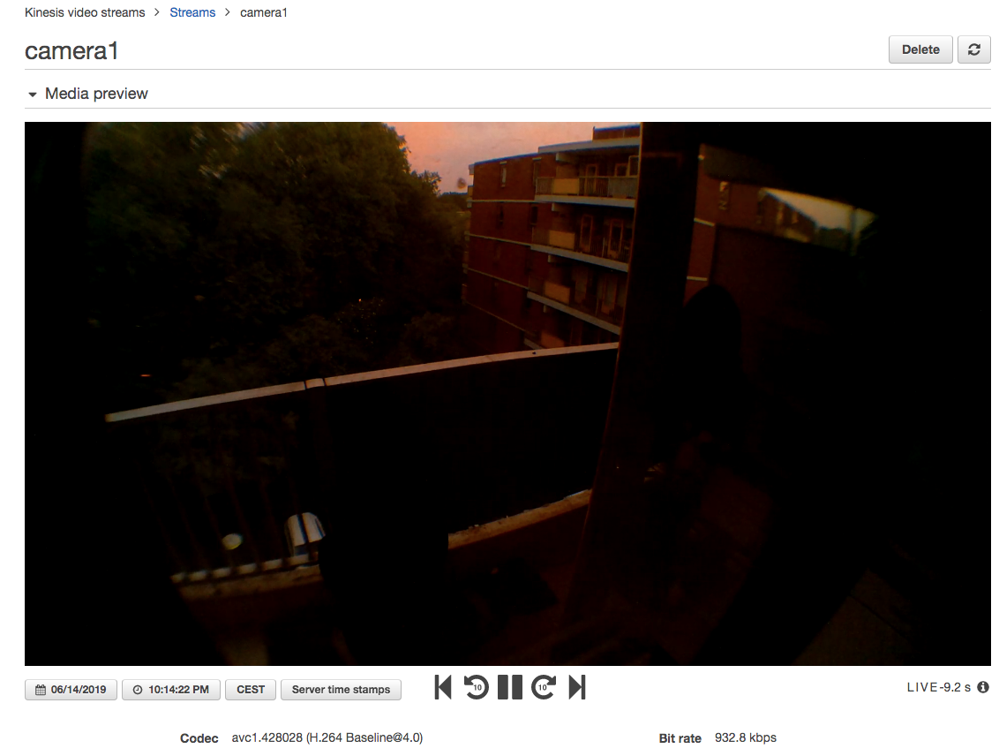

# Streaming video from Raspberry Pi 3(+) to AWS Kinesis Video

## Camera

Install the camera module to the Raspberry Pi. Enable it in raspi-config.


## amazon-kinesis-video-streams-producer-sdk-cpp

You need the _kvssink_ plugin for _gstreamer_ to be able to send your video stream to aws kinesis.

For this you have to build the [Amazon Kinesis Video Streams Producer SDK C/C++](https://github.com/awslabs/amazon-kinesis-video-streams-producer-sdk-cpp) project.

### install prerequisites

See also [Install Steps for Ubuntu 17.x and Raspbian Stretch using apt-get](https://github.com/awslabs/amazon-kinesis-video-streams-producer-sdk-cpp/blob/master/install-instructions-linux.md#install-steps-for-ubuntu-17x-and-raspbian-stretch-using-apt-get)

Install with apt-get / aptitude:


```
git
cmake
g++
libssl-dev
libcurl4-openssl-dev
liblog4cplus-1.1-9
liblog4cplus-dev
libgstreamer1.0-dev
libgstreamer-plugins-base1.0-dev
gstreamer1.0-plugins-base-apps
gstreamer1.0-plugins-bad
gstreamer1.0-plugins-good
gstreamer1.0-plugins-ugly
gstreamer1.0-tools
gstreamer1.0-omx
```


Check if your gstreamer can find the omx plugins.

```
pi@camera2:~ $ gst-inspect-1.0 | grep omx
omx:  omxmpeg2videodec: OpenMAX MPEG2 Video Decoder
omx:  omxmpeg4videodec: OpenMAX MPEG4 Video Decoder
...
```
If you don't see them. It might help to delete the directory `~/.cache/gstreamer-1.0` directory.

### build

Clone the repository of the [Amazon Kinesis Video Streams Producer SDK C/C++](https://github.com/awslabs/amazon-kinesis-video-streams-producer-sdk-cpp) project.

Go into the project directory, then the subdirectory _kinesis_video_native_build_ and run:

```
./min-install-script
```


### Install

When the _min-install-script_ has run successfully. It has built a number of sample applications and a couple of libraries.

It is the latter we are interested in. More specifically:

* libgstkvssink.so The kvssink gstreamer plugin
* libproducer.so The producer library the `libgstkvssink.so` has been linked to

Create a directory to house the gstreamer plugin:

```
mkdir /usr/local/lib/gstreamer-1.0
```

Put the `libgstkvssink.so` in this directory. We will tell gstreamer of it's existence by adding the directory to the GST_PLUGIN_PATH environment variable.

`libgstkvssink.so` is linked to `libproducer.so`. So put the latter into `/usr/local/lib`. Run ldconfig -v as root. You will see that the library will be added to the ld search path.


### Check

pi@camera2:~ $ gst-inspect-1.0 | grep kvssink
kvssink:  kvssink: KVS Sink


## The streaming service

### Install

Install the file from this repository by copying them to:


* etc/systemd/system/kinesis-video.service -> /etc/systemd/system/kinesis-video.service
* etc/default/kinesis-video -> /etc/default/kinesis-video
* sbin/aws_kinesis_live_stream.sh

Run `systemctl daemon-reload`, to scan the new service.

### Configure

#### AWS

Setup a _iam_ user with the correct permissions. Setup a Kinesis Video Stream.
See [Getting Started](https://docs.aws.amazon.com/kinesisvideostreams/latest/dg/getting-started.html)


#### The raspberry pi

Edit `/etc/default/kinesis-video`

Set the correct access-key, secret-access-key , aws-region and stream name to use.
Check that the GST_PLUGIN_PATH includes the directory where you have put the kvssink plugin.

Check / edit `/etc/systemd/system/kinesis-video.service`. Note the 'user'.

Create this user and add it to the `video` group.

Check / edit `sbin/aws_kinesis_live_stream.sh`. Note the LOG_CONFIG.

Copy the `kvs_log_configuration` from the _Amazon Kinesis Video Streams Producer SDK C/C++_ project's `kinesis-video-native-build` directory and put it in the directory where LOG_CONFIG points to.

If necessary create this directory and chown it to the user you created above.

I would recommend editing the `kvs_log_configuration` and modifying the root logging level. The DEBUG level produces an awful lot of logging.


### Enable and start

* systemctl enable kinesis-video
* systemctl start kinesis-video
* systemctl status kinesis-video

### View the stream at aws kinesis dashboard



... yes it was getting dark after all this 'hacking' and writing ...

### And let the fun begin

Now you can wield the power of AWS Kinesis, to do something with your video stream. Standard it will be stored with a retention of 1 day, so you can e.g. rewind to check important events captured by your camera. You can also feed the steam to other services, e.g. to recognize faces and take actions based on this.
